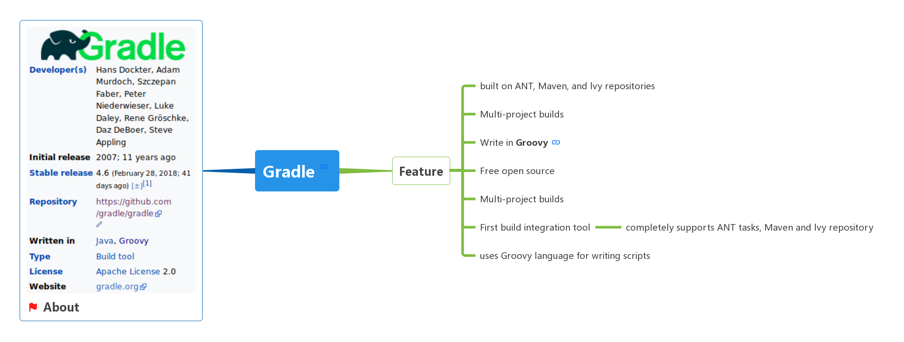

[](#) &nbsp;  [](#) &nbsp;  [](#) &nbsp;  [](#) &nbsp;  [](#) &nbsp;  [](#)

# Gradle &nbsp; [](#) [](https://gradle.org/)

```
```

[点击查看完整图](https://www.processon.com/embed/mind/5ad0a6dde4b0469106318e22)

# Resource
