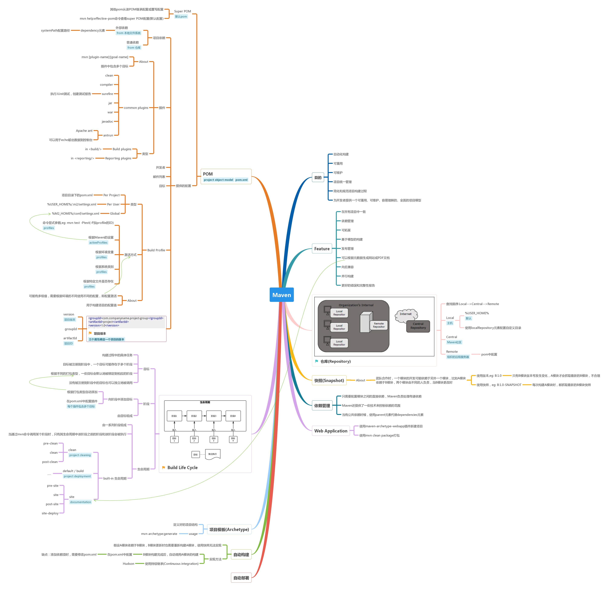

[](#) &nbsp;  [](#) &nbsp;  [](#) &nbsp;  [](#) &nbsp;  [](#) &nbsp;  [](#)

# Apache Maven &nbsp; [](#) [](https://maven.apache.org/)

```
Apache Maven 是一个项目管理工具，自动化构建工具。基于POM实现一个项目的构建、文档、报告的统一管理。Maven可以用于任何Java项目。
```

[点击查看完整图](https://www.processon.com/embed/mind/5a655904e4b0332f153fc9c9)

# Resource

- [Introduction to the Build Lifecycle](https://maven.apache.org/guides/introduction/introduction-to-the-lifecycle.html)
- [Maven - Build Life Cycle](https://www.tutorialspoint.com/maven/maven_build_life_cycle.htm)
- [Maven - Build Profiles](https://www.tutorialspoint.com/maven/maven_build_profiles.htm)
- [Maven - Repositories](https://www.tutorialspoint.com/maven/maven_repositories.htm)
- [Maven - Central Repository](https://repo1.maven.org/maven2/)
- [Maven - Creating Project](https://www.tutorialspoint.com/maven/maven_creating_project.htm)
- [Maven - Project Templates](https://www.tutorialspoint.com/maven/maven_project_templates.htm)
- [Maven - Snapshots](https://www.tutorialspoint.com/maven/maven_snapshots.htm)
- [Maven - Build Automation](https://www.tutorialspoint.com/maven/maven_build_automation.htm)
- [Maven - Manage Dependencies](https://www.tutorialspoint.com/maven/maven_manage_dependencies.htm)
- [Maven - Deployment Automation](https://www.tutorialspoint.com/maven/maven_deployment_automation.htm)
- [Maven Repository: Search/Browse/Explore](http://mvnrepository.com/)