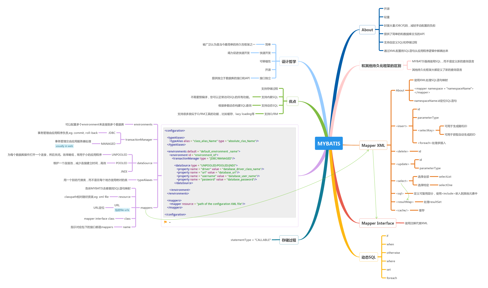

[](#) &nbsp;  [](#) &nbsp;  [](#) &nbsp;  [](#) &nbsp;  [](#) &nbsp;  [](#)

# MYBATIS &nbsp; [](#) [](http://www.mybatis.org/mybatis-3/)

```
MYBATIS是一个开源、轻量的持久化框架，可以在Java，.NET和Ruby on Rails中自动化SQL数据库和对象之间的映射。 MYBATIS使得建立更好的面向数据库的应用程序更容易，更快，代码更少
```

[点击查看完整图](https://www.processon.com/embed/mind/5a688d75e4b0d57f1c7b4f37)

# Resource

- [MYBATIS Documentation](http://www.mybatis.org/mybatis-3/getting-started.html) 
- [MYBATIS Tutorial](https://www.tutorialspoint.com/mybatis/)