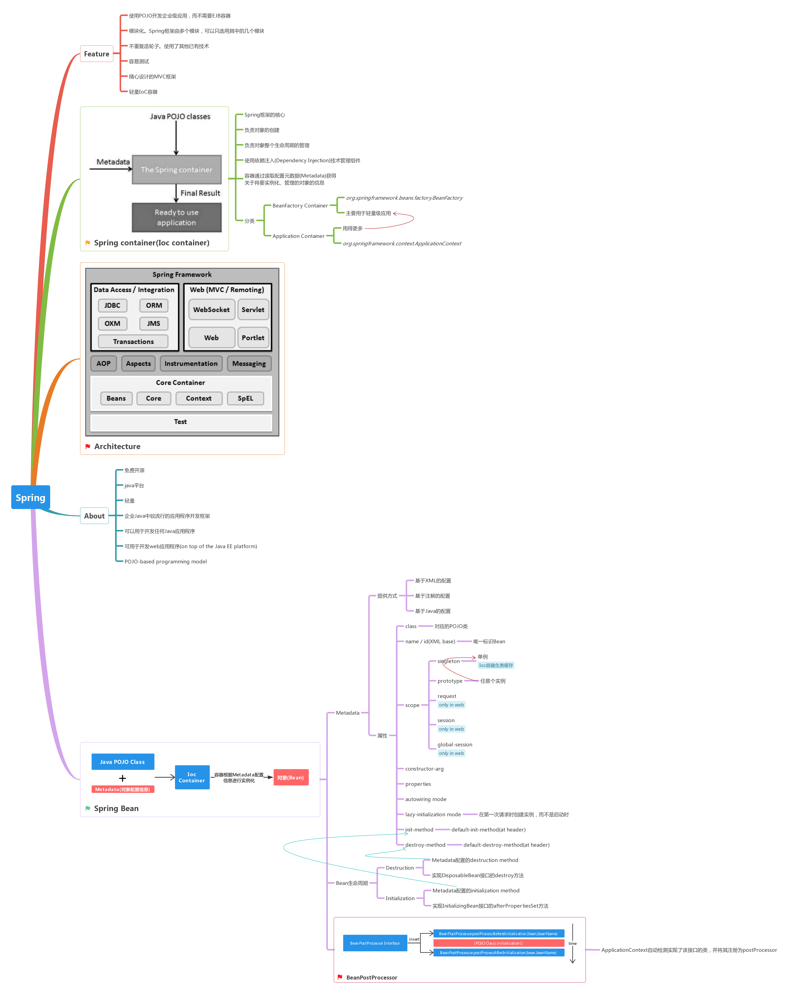

[](#) &nbsp;  [](#) &nbsp;  [](#) &nbsp;  [](#) &nbsp;  [](#) &nbsp;  [](#)

# Spring &nbsp; [](#) [](https://spring.io/)

```
Spring框架是一个开源的Java平台，可以非常简单快速地为开发强大的Java应用程序提供全面的基础架构支持。Spring框架最初由Rod Johnson编写，并于2003年6月首次在Apache 2.0许可下发布。Spring是企业Java中较流行的应用程序开发框架。
```

[点击查看完整图](https://www.processon.com/embed/mind/5a5dedffe4b0a447b9a92ee0)

# Resource

- [Learn Spring - HelloWorld](https://www.coolcodes.me/2018/01/17/Spring-HelloWorld/)
- [Learn Spring - Bean Scope属性之singleton和prototype](https://www.coolcodes.me/2018/01/17/Spring-Scope_singleton_and_prototype/)
- [Learn Spring - BeanPostProcessor](https://www.coolcodes.me/2018/01/18/Spring-BeanPostProcessor/)
- [Learn Spring - Bean配置继承(配置重用)](https://www.coolcodes.me/2018/01/19/Spring-Bean_inheritance/)
- [Learn Spring - 依赖注入(Dependency Injection)](https://www.coolcodes.me/2018/01/19/Spring-DependencyInjection/)
- [Spring - Java Based Configuration](https://www.tutorialspoint.com/spring/spring_java_based_configuration.htm)
- [Event Handling in Spring](https://www.tutorialspoint.com/spring/event_handling_in_spring.htm)
- [Spring Events](http://www.baeldung.com/spring-events)
- [Custom Events in Spring](https://www.tutorialspoint.com/spring/custom_events_in_spring.htm)
- [Spring tutorial](https://www.tutorialspoint.com/spring/)
- [AOP with Spring Framework](https://www.tutorialspoint.com/spring/aop_with_spring.htm)
- [XML Schema Based AOP with Spring](https://www.tutorialspoint.com/spring/schema_based_aop_appoach.htm)
- [@AspectJ Based AOP with Spring](https://www.tutorialspoint.com/spring/aspectj_based_aop_appoach.htm)
- [Spring - JDBC Framework Overview](https://www.tutorialspoint.com/spring/spring_jdbc_framework.htm)
- [Spring JDBC Example](https://www.tutorialspoint.com/spring/spring_jdbc_example.htm)
- [SQL Stored Procedure in Spring](https://www.tutorialspoint.com/spring/calling_stored_procedure.htm)
- [Spring - Logging with Log4J](https://www.tutorialspoint.com/spring/logging_with_log4j.htm)
- [Spring Framework API)](https://docs.spring.io/spring-framework/docs/current/javadoc-api/)