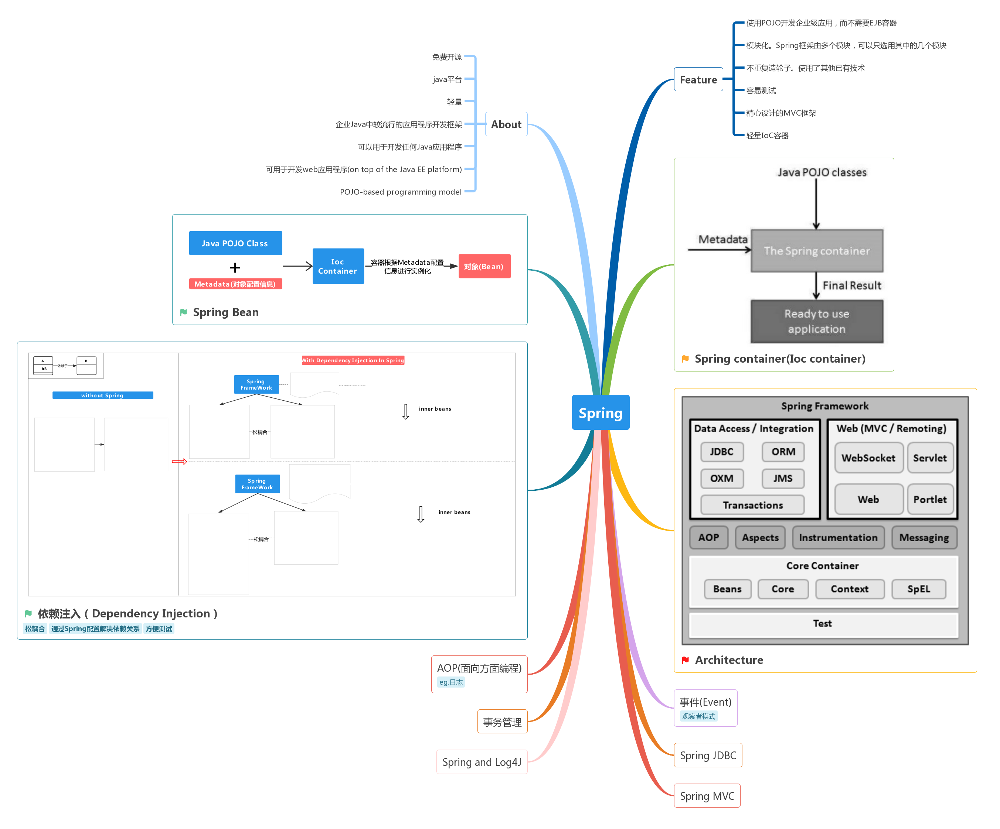

[](#) &nbsp;  [](#) &nbsp;  [](#) &nbsp;  [](#) &nbsp;  [](#) &nbsp;  [](#)

# Spring &nbsp; [](#) [](https://spring.io/)

```
Spring框架是一个开源的Java平台，可以非常简单快速地为开发强大的Java应用程序提供全面的基础架构支持。Spring框架最初由Rod Johnson编写，并于2003年6月首次在Apache 2.0许可下发布。Spring是企业Java中较流行的应用程序开发框架。
```

