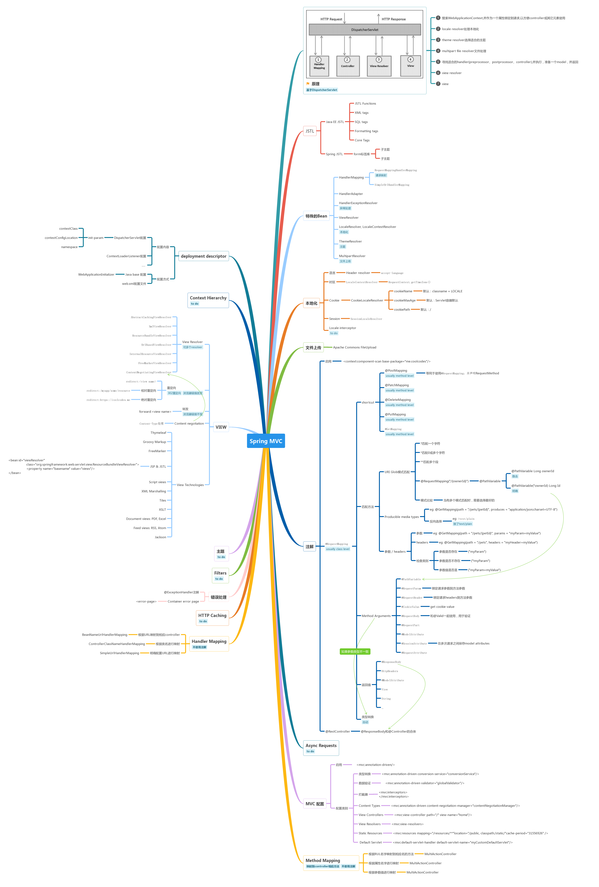

[](#) &nbsp;  [](#) &nbsp;  [](#) &nbsp;  [](#) &nbsp;  [](#) &nbsp;  [](#)

# Spring MVC &nbsp; [](#)

```
Spring MVC 是Spring框架的一部分。用于开发基于Java的Web应用程序。
```

[点击查看完整图](https://www.processon.com/embed/mind/5a65db10e4b0abe85d6851e2)

# Resource

- [Spring MVC tutorial](https://www.tutorialspoint.com/springmvc/index.htm)
- [Spring - MVC Framework Overview](https://www.tutorialspoint.com/springmvc/springmvc_overview.htm) 
- [JSTL Quick Reference](http://cs.roosevelt.edu/eric/books/JSP/jstl-quick-reference.pdf)
- [JSP - Standard Tag Library (JSTL) Tutorial](https://www.tutorialspoint.com/jsp/jsp_standard_tag_library.htm)
- [Official Spring Web MVC Specification](https://docs.spring.io/spring/docs/current/spring-framework-reference/web.html)
- [spring-mvc-showcase](https://github.com/spring-projects/spring-mvc-showcase)  []()