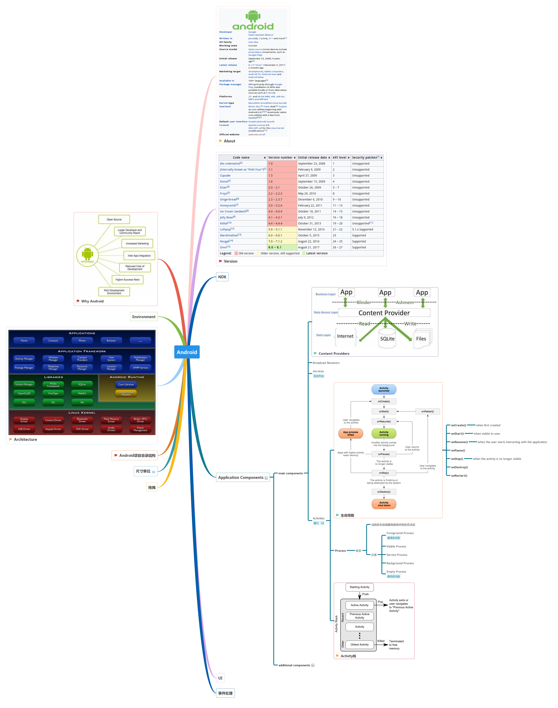

 &nbsp;   &nbsp;   &nbsp;   &nbsp;   &nbsp;  

# Android &nbsp;   

[点击查看完整图](https://www.processon.com/embed/mind/5a93b145e4b083b04399ef4d)

# Resource

- [What is the difference between “px”, “dip”, “dp” and “sp”?](https://stackoverflow.com/questions/2025283/what-is-the-difference-between-px-dip-dp-and-sp)